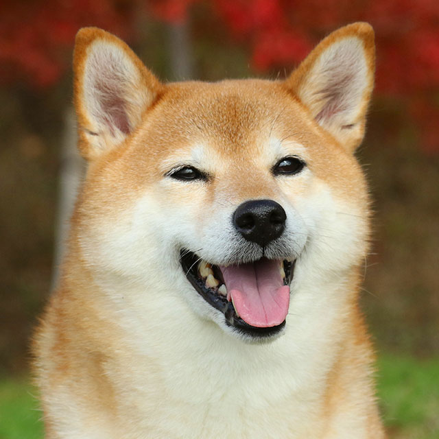

# Manipulação de Imagem com NumPy

Desafio da Aula 03 | Módulo 04 | Data Science Degree - Let's Code

**Repositório: desafio-imagem-numpy**

## 👨‍💻 Autor
Ewerthon José Kutz.

## 💡 Conceitos utilizados
- Arrays e Matrizes multidimensionais.
- Representação computacional de imagens.
- Representação computacional de cores (RGB).
- Manipulação de imagens com a biblioteca Numpy.
- Manipulação de imagens com a biblioteca scikit-image.
- Visualização deimagens com a biblioteca Matplotlib.

Complexidade: Iniciante.

## 👨🏻‍🏫 Descrição
O desafio é abrir um arquivo de imagem de um cachorro Shiba inu (sim, o do Dogecoin) e efetuar **quatro** operações nessa imagem:

1. Cortar a imagem no sentido vertical.
2. Cortar a imagem no sentido horizontal.
3. Apagar o nariz do cachorro (tecnicamente, transformar os pixels no nariz em pixels de cor branca).
4. Transformar a imagem para escala de cinza.

### 🌇 A imagem

#### 🔍 Curiosidade

A raça de cachorros Shiba inu é de origem japonesa (e uma das mais antigas por lá). Essa raça ficou especialmente conhecida após tornar-se um *meme* de reação muito popular em 2013, dando origem e inspiração à criptomoeda **DOGECOIN**.

A criptomoeda e alguns tweets do Elon Musk fizeram a raça ser facilmente reconhecida em qualquer lugar do mundo.

### 🌇 Dogecoin

### 🌇 Tweets

## 🗺 Contexto

Toda imagem colorida, do ponto de vista computacional, nada mais é do que um conjunto de três matrizes: Vermelho, Verde e Azul (RGB vem de Red, Green e Blue). Cada uma dessas matrizez traz a intensidade da respectiva cor para cada um dos pixels.

Nessas matrizes,os valores vão de 0 a 255. 0 representa a ausência dessa cor e 255 a intensidade mais forte possível dela. Se tivermos um píxel puramente vermelho ele será representado pelos seguintes valores em cada matriz:

- R = 255
- G = 0
- B = 0

Na imagem acima, cada célula da matriz representa um píxel. Uma imagem é formada por vários pixels.

Por outro lado, uma imagem **preta e branca** ou de **escala de cinza** apresenta apenas uma matriz com valores entre 0 e 255 ou entre 0 e 1. No mesmo conceito, quanto mais perto de 0, mais escuro é o píxel e quanto mais distante, mais claro.
